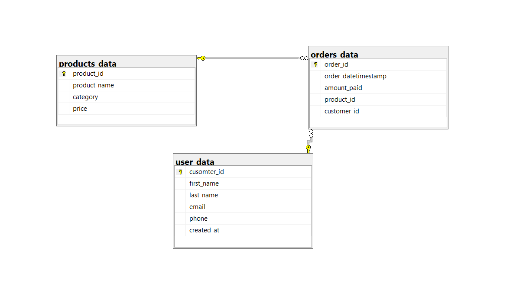
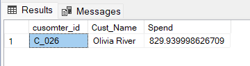
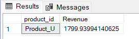
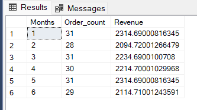
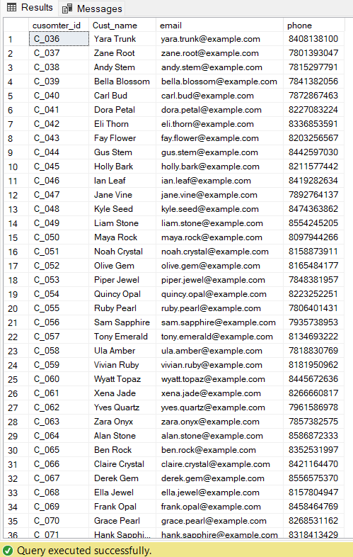
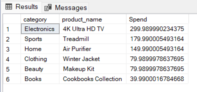

# 📊 User Data Analysis – SQL Case Study

This project is a beginner-friendly SQL case study focused on analyzing user activity, order trends, and revenue patterns from a fictional e-commerce dataset. It demonstrates the use of SQL joins, aggregations, date functions, and ranking functions to solve business questions related to sales performance, customer segmentation, and platform engagement.

## 📌 Project Objective
Analyze customer orders, purchasing behavior, and product trends using SQL. The goal is to generate data-driven insights that can help improve marketing, inventory planning, and customer segmentation.

## 🗂️ Dataset Description
This case study uses three interlinked datasets:
- `user_data`: customer info (cusomter_id, first_name, last_name, email, phone, created_at)
- `orders_data`: order details (order_id, order_datetimestamp, amount_paid, product_id, customer_id)
- `products_data`: product info (product_id, product_name, category, price)

---

## 🧩 ER Diagram




## ❓ Highlighted Business Questions

### 🔹 Q2. Which customer has the highest total spend?

💻 **Query:**
```sql
SELECT TOP 1 cusomter_id,CONCAT(first_name, ' ' ,last_name) AS Cust_Name ,SUM(amount_paid) AS Spend
FROM orders_data AS O
INNER JOIN user_data AS U
ON O.customer_id = U.cusomter_id
GROUP BY cusomter_id, CONCAT(first_name, ' ' ,last_name)
ORDER BY Spend DESC
```

📊 **Result:**

📊 Screenshot:  



💡 **Insight:**  
Customer `C_026` (Olivia River) is the top spender with over $829.939998626709 in purchases.

---

🔹 Q4. Which product_id has generated the highest revenue?

💻 **Query:**
```sql
SELECT TOP 1 product_id, SUM(amount_paid) AS Revenue
FROM orders_data
GROUP BY product_id
ORDER BY Revenue DESC
```

📊 **Result:**

📊 Screenshot:  



💡 **Insight:**  
Product_id 'Product_U' generated highest revenue that is $1799.93994140625

---

### 🔹 Q7. Month-wise Order Count and Revenue

💻 **Query:**
```sql
SELECT DATEPART(MONTH, order_datetimestamp) AS Months, COUNT(order_id) AS Order_count,
       SUM(amount_paid) AS Revenue
FROM orders_data
GROUP BY DATEPART(MONTH, order_datetimestamp)
ORDER BY Revenue, Order_count
```

📊 **Result:**

📊 Screenshot:  



💡 **Insight:**  
Revenue and order count peaked in the month of January and May.


---

### 🔹 Q14. Users Who Signed Up But Didn’t Order

💻 **Query:**
```sql
SELECT U.cusomter_id, first_name + ' '+ last_name AS Cust_name, email, phone
FROM user_data AS U
LEFT JOIN orders_data AS O
ON U.cusomter_id = O.customer_id
WHERE amount_paid IS NULL
```

📊 **Result:**  

📊 Screenshot:  



💡 **Insight:**  
These users signed up but made no purchases — an opportunity for re-engagement campaigns.

---

### 🔹 Q15. For the customer has spent the most, figure out which product category have they 
 spent the most.

💻 **Query:**
```sql
 SELECT category,product_name, SUM(amount_paid) AS Spend
 FROM products_data AS P
 INNER JOIN orders_data AS O
 ON P.product_id = O.product_id
 WHERE customer_id =  (SELECT TOP 1 customer_id --SUM(amount_paid) AS Spend --
                     FROM orders_data
                     GROUP BY customer_id
                     ORDER BY SUM(amount_paid) DESC)
 GROUP BY category, product_name
 ORDER BY Spend DESC
```

📊 **Result:**

📊 Screenshot:  



💡 **Insight:**  
As per Q13. Olivia River spend the most on the item category 'Electronics', prod_name '4K Ultra HD TV' and amount $299.989990234375  

---

## 📁 Project Files
- `user_data_case_study.sql` – Final cleaned SQL queries for all 15 business questions
- `README.md` – Full project overview, queries, insights, and screenshots
- `/images/` – Contains ER diagram and result screenshots for selected queries


---

## 🙋‍♀️ About Me
I’m Kashish, an aspiring Data Analyst with a background in Economics. I'm currently pursuing an Advanced Data Analytics certification (AnalytixLabs + IIT Guwahati). This project is part of my hands-on learning to build a strong portfolio in SQL, Excel, Power BI, and Python.

📫 [LinkedIn Profile](https://www.linkedin.com/in/kashish-kwatra)
💼 Open to internships & entry-level data roles
